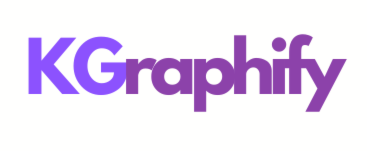

**KGraphify** is a Python library that automatically extracts information from PDF documents and builds a knowledge graph in Neo4j, using a user-defined schema. The library leverages large language models (LLMs) to understand and structure the content of the PDF into a structured format that matches with the schema. 

## Features

- **PDF Parsing**: Extract text from PDF files, preserving structure and key entities.
- **Schema Mapping**: Define your own schema to structure the graph nodes and relationships.
- **Graph Creation**: Automatically generates a knowledge graph in Neo4j.
- **LLM Integration**: Uses language models to interpret and structure content to match the defined schema

## License
This project is licensed under the MIT License.

